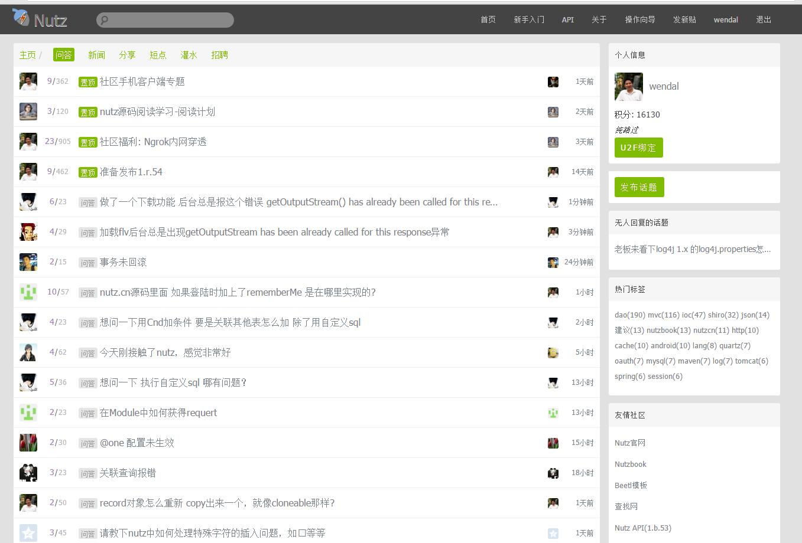

# NutzCN社区

Nutz主库地址 https://github.com/nutzam/nutz 来个star呗

## 在线演示地址

论坛系统(即Nutz社区) https://nutz.cn

* 管理后台  https://nutz.cn/home
* 管理后台2  https://nutz.cn/admin
* 管理后台3 https://nutz.cn/admin2

## 部署指南

**本项目必须依赖Redis数据库** http://redis.io

请查阅[部署指南](INSTALL.md)

Redis-Windows 下载地址 https://github.com/MSOpenTech/redis/releases

后台管理账户密码 admin/123456

## 特色

* 完善的发帖回帖机制,引导式发帖
* Session实现2层持久化,兼顾性能和持久化
* 回帖提醒(页面端使用WebSocket,客户端使用小米推送和极光推送)
* 打赏机制
* Android及ios客户端,可轻易定制自己的版本

## 手机客户端

Android官方客户端 

  * 下载地址 http://app.xiaomi.com/detail/419235
  * 源码地址 https://github.com/wendal/NutzCN-Material-Design

iOS客户端

  * 下载地址 https://itunes.apple.com/us/app/nutz-she-qu/id1082195150?l=zh&ls=1&mt=8
  * 源码地址 https://github.com/TuWei1992/NutzCommunity

## 使用到的技术

* 基本的增删改查,MVC各种用法及文件上传
* Dao关联关系(One/Many/ManyMany)
* 邮件发送及基于3DES的无数据库验证机制
* Quartz计划任务集成
* Shiro集成及权限管理
* Ehcache及DaoCache集成
* redis 集成
* beetl模板集成及应用
* 二维码生成及跨屏登陆
* 声明式系统日志,SLog注解及相关服务
* 基于socialauth的Oauth登陆(Github及QQ登陆)
* 集成极光推送(jpush)及小米推送(xmpush)
* WebSocket

## 曾经集成,但已经移除的功能

* U2F绑定与登陆
* zbus集成(RPC及MQ)
* jetbrick模板集成
* socketio 集成及demo聊天工具
* 洋葱登录

## 关于目录结构变化

nutzbook中的代码是eclipse结构的, 本项目最新的代码已经改为maven格式, 映射关系如下

* src -- src/main/java
* conf -- src/main/resources
* WebContent -- src/main/webapp

eclipse依然可以直接导入本项目

## 依赖的jar包下载

http://nutzbook.wendal.net/jars/

## License

MIT License或Apache License 双授权协议. -- 事实上我懒得选.

极为宽松,请大胆商用,大胆闭源,本库的代码完全免费. 任选MIT/Apache协议执行即可.